# ouranos-ws

## Getting Started

> Please note that ouranos-ws is currently under development and some unintended uses could cause issues, such as deleting an entity that another depends on.

### Prerequisites

- [Debian](https://www.debian.org/)
- [Docker Engine](https://docs.docker.com/engine/install/debian/)
- [Docker Compose](https://docs.docker.com/compose/install/) (included with Docker Engine)
- [Certbot](https://certbot.eff.org/instructions?ws=other&os=debianbuster)
- [PHP](https://www.php.net/downloads/) `sudo apt install php-fpm`
- [Composer](https://getcomposer.org/download/)
- [Git](https://git-scm.com/) `sudo apt install git`
- Zip & Unzip `sudo apt install zip unzip`
- Wget `sudo apt install wget`

> PHP and Composer are only used to generate the encryption key, what can be done on another machine. If you are doing it on the same machine, make sure you are using a version of PHP that does not include Apache, to avoid a conflict with the use of ports 80 and 443.

### Installation

- Create type A DNS entries for the following subdomains

    - api.ouranos-ws.example.com
    - app.ouranos-ws.example.com
    - data-models.ouranos-ws.example.com
    - idm.example.com

- Generate HTTPS certificates

    - `sudo certbot certonly --standalone -d api.ouranos-ws.example.com`
    - `sudo certbot certonly --standalone -d app.ouranos-ws.example.com`
    - `sudo certbot certonly --standalone -d data-models.ouranos-ws.example.com`
    - `sudo certbot certonly --standalone -d idm.example.com`

- Clone this repository

    ```
    git clone https://github.com/faubourg-numerique/ouranos-ws.git
    ```

- Enter the cloned repository

    ```
    cd ./ouranos-ws
    ```

- Create and edit the docker compose environment file

    ```
    cp ./.env.example ./.env
    ```

- Create and edit the reverse proxy config file

    ```
    cp ./nginx.conf.example ./nginx.conf
    ```

- Create and edit the ouranos-ws config files

    ```
    cp ./config/ouranos-ws-api/.env.example ./config/ouranos-ws-api/.env
    cp ./config/ouranos-ws-app/config.js.example ./config/ouranos-ws-app/config.js
    ```

- Clone the ouranos-ws data model repository

    ```
    git clone https://github.com/faubourg-numerique/ouranos-ws-data-model.git ./data-models/ouranos-ws/1
    ```

- Set Apache as the owner of the **data-models** directory

    ```
    sudo chown www-data:www-data -R ./data-models
    ```

- Install the ouranos-ws modules

    - Download the modules

    ```
    wget -O "./ouranos-ws-api-data-services-module-1.0.1.zip" https://github.com/faubourg-numerique/ouranos-ws-api-data-services-module/archive/refs/tags/1.0.1.zip
    ```

    ```
    wget -O "./ouranos-ws-api-wot-module-1.0.0.zip" https://github.com/faubourg-numerique/ouranos-ws-api-wot-module/archive/refs/tags/1.0.0.zip
    ```

    ```
    wget -O "./ouranos-ws-api-dsc-module-1.0.0.zip" https://github.com/faubourg-numerique/ouranos-ws-api-dsc-module/archive/refs/tags/1.0.0.zip
    ```

    - Extract the modules

    ```
    unzip ./ouranos-ws-api-data-services-module-1.0.1.zip
    ```

    ```
    unzip ./ouranos-ws-api-wot-module-1.0.0.zip
    ```

    ```
    unzip ./ouranos-ws-api-dsc-module-1.0.0.zip
    ```

- Generate an encryption key
    > All sensitive data (passwords, private keys, etc) is stored encrypted.

    - Install the dependencies

        ```
        composer install
        ```

    - Generate an encryption key

        ```
        php ./vendor/defuse/php-encryption/bin/generate-defuse-key
        ```

    - Update the `ENCRYPTION_KEY` variable of the **./config/ouranos-ws-api/.env** file

- Generate a Google Maps API key (optional)

    > In order for the maps to work, a Google Maps API key must be provided.

    - Go to [**Google Maps Platform** → **Keys & Credentials**](https://console.cloud.google.com/google/maps-apis/credentials)

    - Click on **CREATE CREDENTIALS** → **API key**

        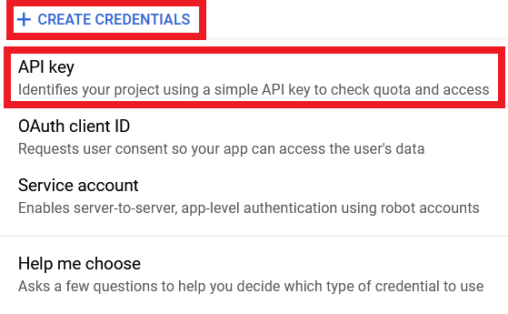

        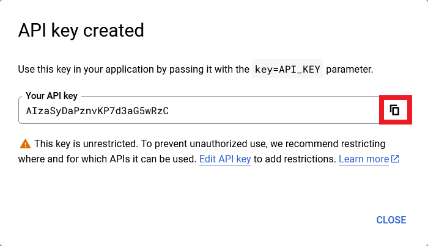

    - Update the `window.googleMapsApiKey` variable of the **./config/ouranos-ws-app/config.js** file

- Create a Google Service Account (optional)

    > To be able to import and export entities from Google Sheets, a Google service account must be provided.

    - Go to the [**Google Cloud Platform** → **IAM & Admin** → **Service Accounts**](https://console.cloud.google.com/iam-admin/serviceaccounts)

    - Click on **CREATE SERVICE ACCOUNT**

        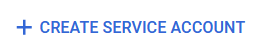

    - Follow the steps to create the service account

        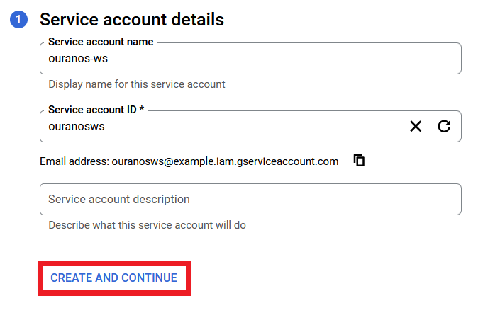

        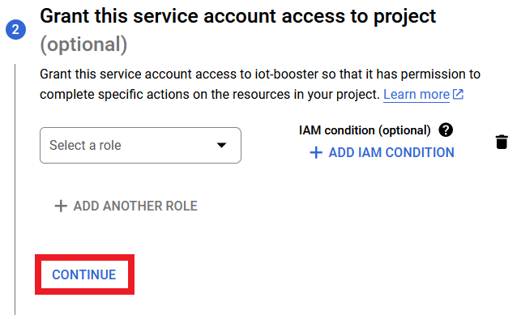

        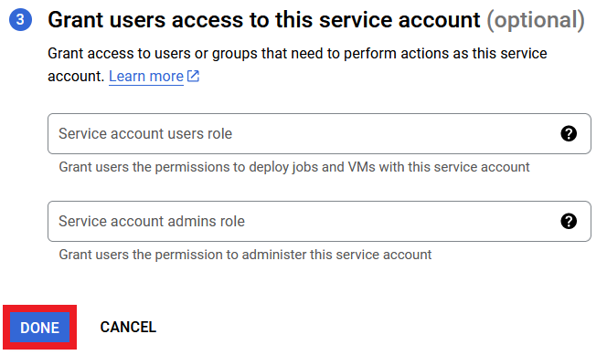

    - Click on **Add Key** → **Create new key** in the **Keys** tab of the service account

        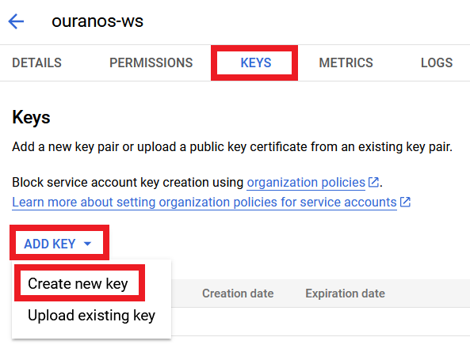

    - Select the **JSON** key type and click **CREATE**

        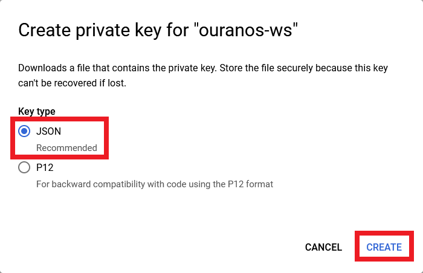

    - Rename the downloaded file to **service-account.json** and move it to this directory

        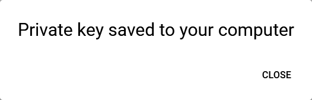

    - Update the `window.googleServiceAccount` variable of the **./config/ouranos-ws-app/config.js** file with the service account email

- Configure the identity manager

    - Start the services

        ```
        sudo docker compose up -d
        ```

    - Log in using the credentials provided in **.env**

        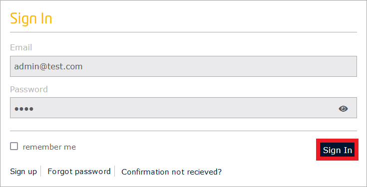

    - Create an application

        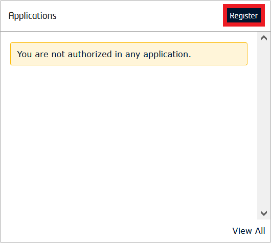

        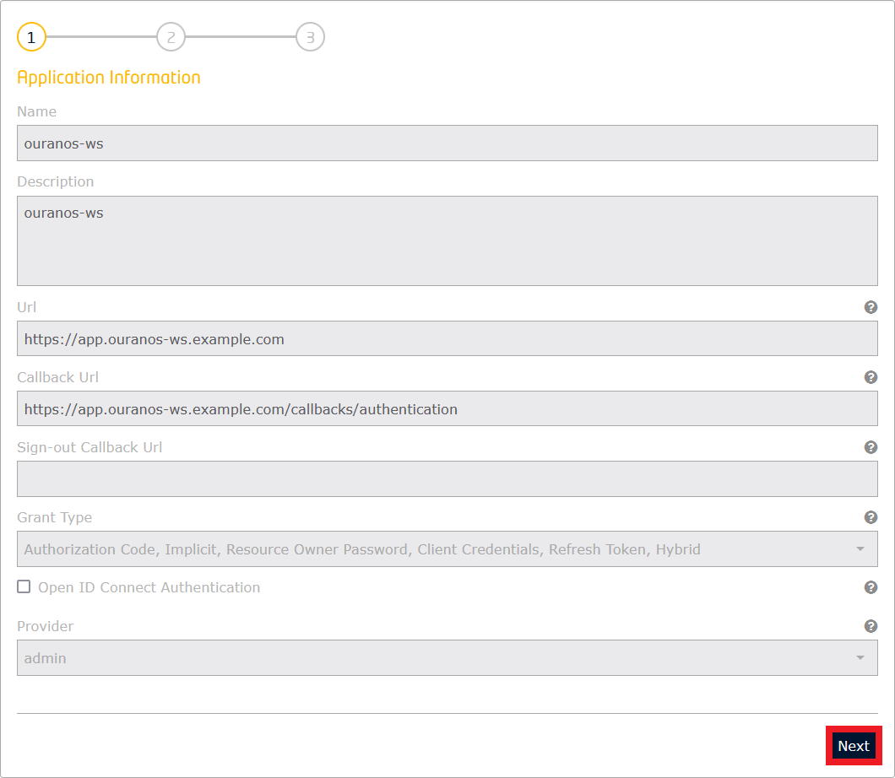

        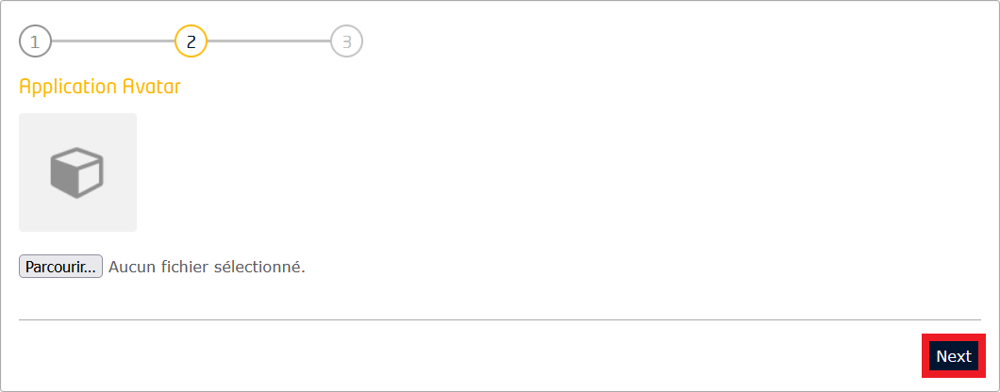

    - Create an **Admin** role

        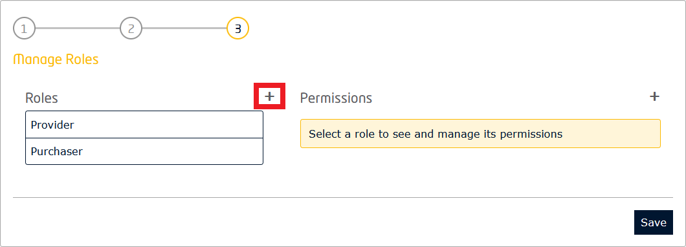

        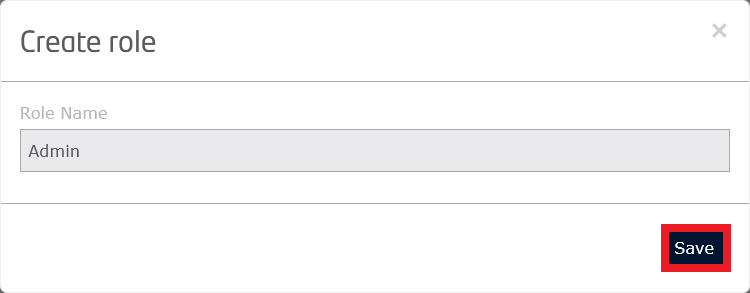

    - Select the **Admin** role

        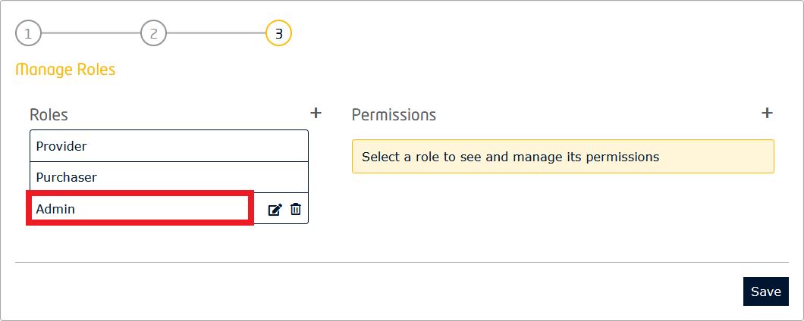

    - Create a permission

        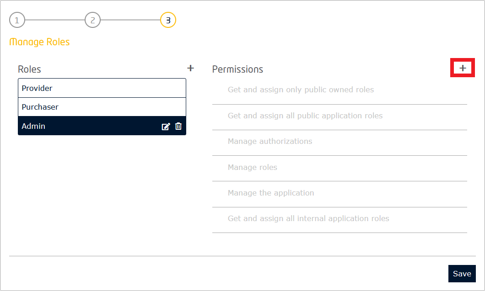

        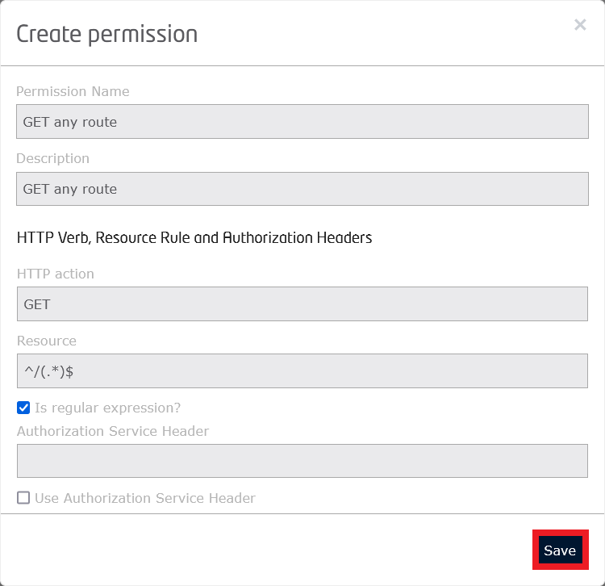

    - Repeat the operation for the **POST**, **PUT**, **PATCH** and **DELETE** methods

    - Select all created permissions

        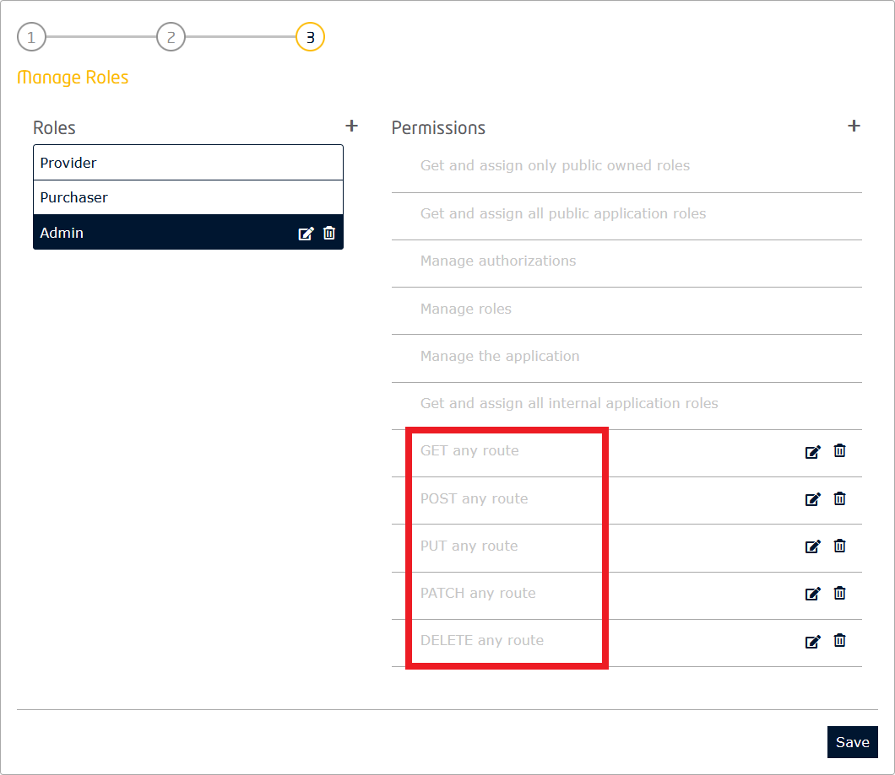

    - Save the roles

        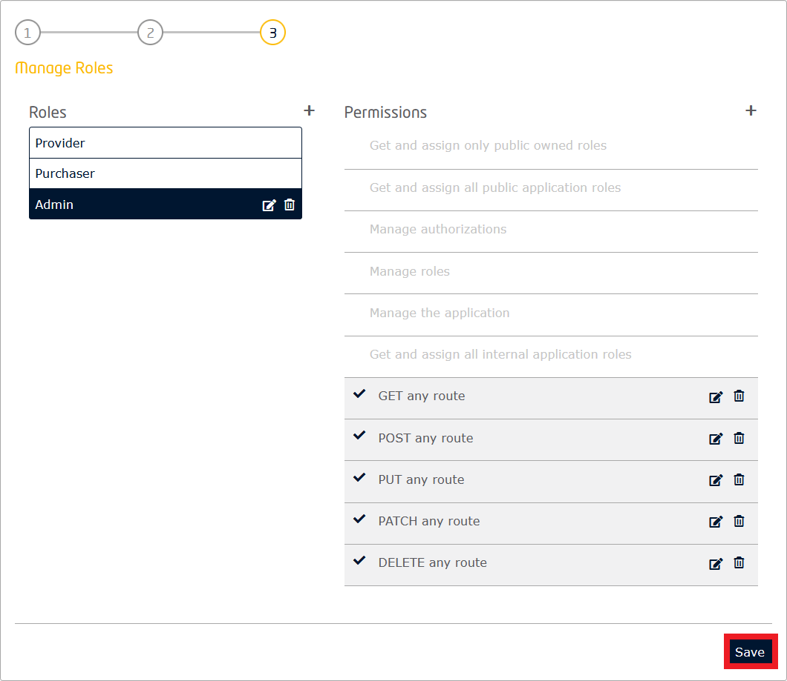

    - Deploy the OAuth2 Credentials section

        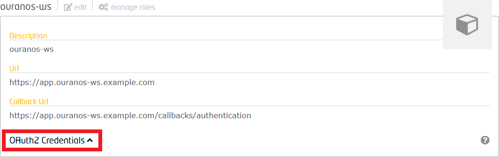

        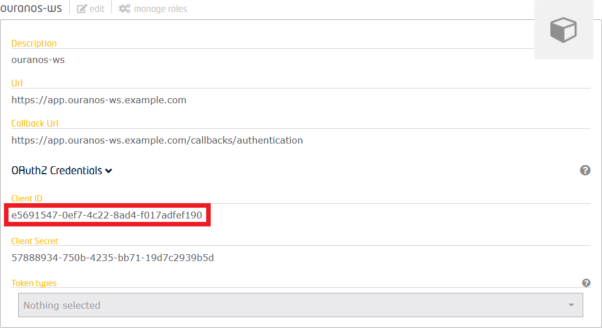

    - Update the `AUTHORIZATION_IDENTITY_MANAGER_APP_ID` variable of the **./config/ouranos-ws-api/.env** file with the application client id

    - Update the `window.identityManagerClientId` variable of the **./config/ouranos-ws-app/config.js** file with the application client id

    - Open the authorization section

        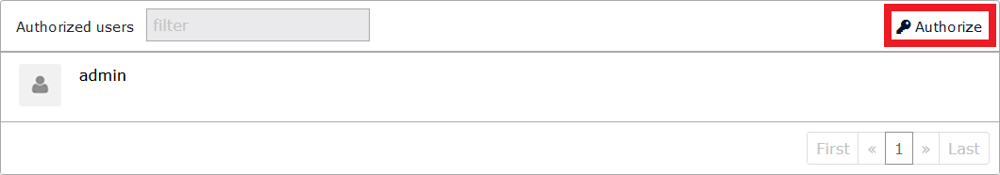

    - Add the role **Admin** to the **admin** user and save

        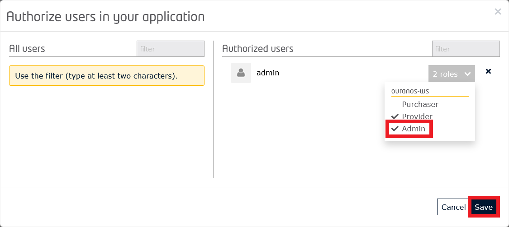

    - Stop the services

        ```
        sudo docker compose down
        ```

## Usage

- Start the services

    ```
    sudo docker compose up -d
    ```

- Stop the services

    ```
    sudo docker compose down
    ```

## Documentation (outdated)

- [API documentation](https://faubourg-numerique.gitbook.io/ouranos-ws-api/)
- [APP documentation](https://faubourg-numerique.gitbook.io/ouranos-ws-ui/)
